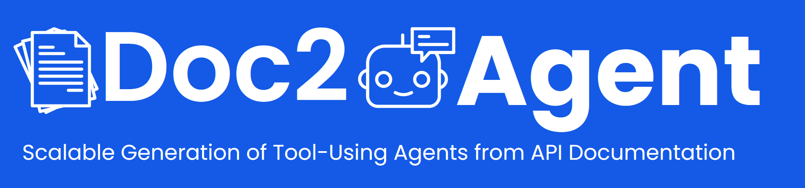
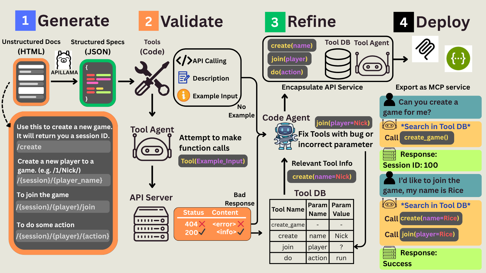

# 📄➡️🤖 Doc2Agent



**Doc2Agent** is your one-stop pipeline for transforming unstructured REST API documentation into **agent-ready Python tools**—ready to plug into LLM-based applications. Built with scalability and automation in mind, Doc2Agent bridges the gap between real-world APIs and AI agents.

Tired of wrangling vague docs and inconsistent schemas? Doc2Agent automates the entire pipeline—from extraction and validation to refinement and deployment—so you can focus on building powerful, intelligent agents.

---

## 🏭 What Is Doc2Agent?

Real-world APIs are messy. Documentation is often incomplete, outdated, or poorly structured—making direct integration with LLM agents a nightmare.

Doc2Agent offers a scalable, fully automated solution to:

* 📦 **Generate Python-based API tools** from natural language docs
* 🧪 **Diagnose and fix tool errors** through automated validation
* 🔁 **Refine tools** with inferred parameters—no domain knowledge required
* 🚀 **Deploy agents** that use these tools directly via MCP or OpenAPI

> 🧠 Doc2Agent has been shown to improve task success by up to **55%**, while cutting cost by **90%**, compared to direct API calling (see our [paper](Doc2Agent.pdf)).



---

## ✨ Features

* 🔧 **Automated Tool Generation**
  Convert messy API docs into Python functions, fully compatible with LangGraph, LlamaIndex, AutoGen, and more.

* 🧠 **Self-Diagnosis & Refinement**
  Evaluate tool functionality and iteratively fix bugs using a code agent. It even infers missing parameter values!

* 📚 **Knowledge Base Matching**
  Reuse known parameter values and results from other tools to fill gaps in documentation.

* 🌐 **MCP & OpenAPI Deployment**
  Deploy your toolset as a server (MCP) or export as OpenAPI specs for enterprise use.

---

## 🚀 Getting Started

### 1. Setup Environment

Install requirements and add your OpenAI key:

```bash
pip install -r requirements.txt
```

Then update `.env`:

```
OPENAI_API_KEY=your_api_key
```

---

### 2. Prepare Your API Docs

Place your HTML/Markdown files in a new folder under:

```
extractor/apidocs/<your_api_name>
```

You can download HTML docs using "Save Page As" in your browser.

---

### 3. Optional: Add `.config` (if needed)

Some docs miss critical info like `base_url` or headers. Add a `.config` file like:

```json
{
  "base_url": "https://api.example.com",
  "headers": {
    "Authorization": "YOUR_TOKEN"
  },
  "info": {
    "user_id": "123",
    "user_name": "your_name"
  }
}
```
* `base_url`: overwrites the base url. Useful when raw API doc doesn't include base_url
* `headers`: will be used in API calling. Put your authentication info here!
* `info`: you can define some custimizable parameter values to help with validation and refinement.
---

### 4. Generate Tools

Run the tool generator:

```bash
python extractor/api_code_generator.py extractor/apidocs
```

---

### 5. Validate & Refine Tools

Automatically verify tool functionality and infer missing values:

```bash
python main/validation_and_refinement_main.py
```

---

### 6. Deploy as an MCP Server

Expose your tools via [FastMCP](https://mem0.ai/openmemory-mcp):

* Copy validated tools to:

```
my_mcp_server/my_mcp_server/MCPTools
```

* Use the config:

```json
{
  "mcpServers": {
    "my_custom_mcp": {
      "command": "uv",
      "args": [
        "--directory",
        "PROJECT_PATH/my_mcp_server/my_mcp_server",
        "run",
        "server.py"
      ]
    }
  }
}
```

---

## 📈 Benchmarks & Results

Doc2Agent outperforms direct API calls on WebArena and scientific domains like glycoscience:

| Method          | Avg. Success Rate | Cost per Task |
| --------------- | ----------------- | ------------- |
| Direct API Call | 29.2%             | \$1.20        |
| Hybrid Agent    | 38.9%             | \$1.50        |
| **Doc2Agent**   | **45.3%**         | **\$0.12**    |

Doc2Agent also enables research agents (e.g., glycan databases) with zero manual coding.

